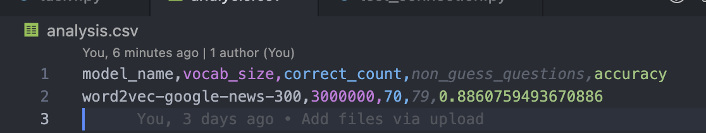
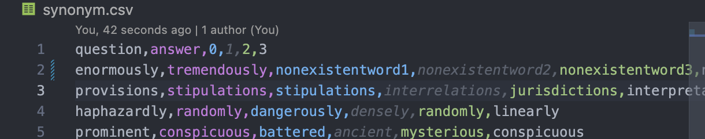
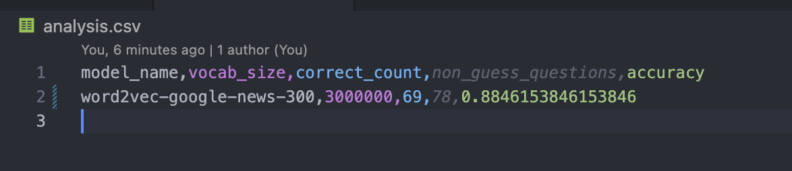

# COMP472-A2
**Alexandra Zana** 

***ID: 40131077***

**Brayden Tsitsirides**

------------------

## Notes on running the program
Assuming you have Python 3.11 and Genism downloaded.

- There seems to be an issue with the genism loader; I posted a StackOverflow question about it here:
https://stackoverflow.com/questions/77567868/jsondecodeerror-and-filenotfounderror-when-loading-word2vec-google-news-300-mode

- Therefore, I instead downloaded the model manually from Google's drive:
https://drive.google.com/file/d/0B7XkCwpI5KDYNlNUTTlSS21pQmM/edit?resourcekey=0-wjGZdNAUop6WykTtMip30g

- This alternative method works correctly, but it is a large file (around 1.53 GB), so it may take a little longer to download. Until I figure out how to fix the genism loader, this is the only way to run the program, which technically seems to be completely appropriate according to Gensim documentation and other StackOverflow posts.

- NOTE: Of course the model takes a bit long to run because it is a huge file with like 3million words. I will try to make it so that it only runs once, and will save the model as a .bin file so that it can be loaded in the future. However, if you want to run it again, you can delete the .bin file and it will run again. (if i have time)
- Refer to StackOverflow article below related to model run time optimization: https://stackoverflow.com/questions/42986405/how-to-speed-up-gensim-word2vec-model-load-time?rq=2

--------
## Task 1
- Initial model: Google News Word2Vec model
- Analysis in the analysis.csv file:

**Test case 1:**
Modifying the synonym.csv file so that none of the words are in the model's vocabulary. The model should not be able to find any synonyms for any of the words in the synonym.csv file, so it should return 'guess' for that word inside the generated word2vec .csv file:
Guessword test case:

Guessword analysis:

Guessword modification output:

MISC
https://stackoverflow.com/questions/39549248/how-to-load-a-pre-trained-word2vec-model-file-and-reuse-it
